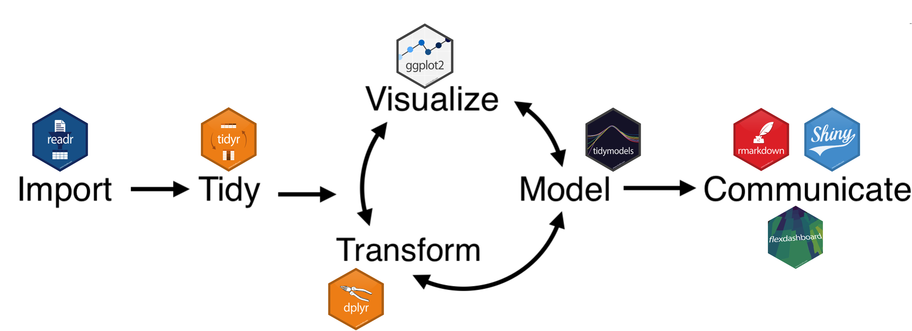
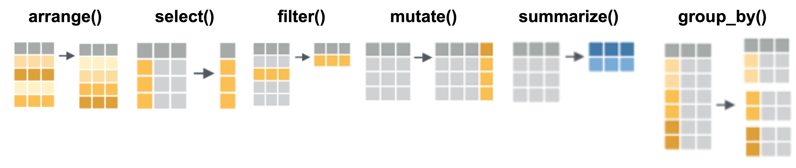

```{r setup, include=FALSE}
knitr::opts_chunk$set(echo = TRUE, message = FALSE, warning = FALSE)
```

# Welcome!

Hello, and welcome to rainbowR's Intro to R workshop! We are using an R Notebook. An R Notebook is an R Markdown document with code blocks that can be executed independently and interactively, with the output visible immediately beneath the input. They are an implementation of [Literate Programming](https://en.wikipedia.org/wiki/Literate_programming) that allows for direct interaction with the R programming language while producing a reproducible document with publication-quality output. R notebooks can also be rendered using the knit button {width="37" height="16"} to create an HTML document that is easily viewable outside of R. We can see the difference between text and code as the text is in the white space and code blocks are in grey. To run any particular line of code, click the green play button {width="14"} in that chunk, or with your cursor in the grey code block, press control, shift, enter (⬆⌘⏎) simultaneously.

Try it here:

```{r}
plot(cars)
```

We see our results from that line of code immediately below it, which happens to be a graph about the speed and distance of different kinds of cars. Let's move on to the data we will use for this workshop!

# Data Introduction

We will be using [The Youth Risk Behavior Surveillance System (YRBSS)](https://www.cdc.gov/healthyyouth/data/yrbs/overview.htm). It is a set of surveys that track behaviors that can lead to poor health in students grades 9 through 12. The surveys are administered every other year. Some of the health-related behaviors and experiences monitored are:

-   Student demographics: sex, sexual identity, race and ethnicity, and grade

-   Youth health behaviors and conditions: sexual, injury and violence, bullying, diet and physical activity, obesity, and mental health, including suicide

-   Substance use behaviors: electronic vapor product and tobacco product use, alcohol use, and other drug use

-   Student experiences: parental monitoring, school connectedness, unstable housing, and exposure to community violence

This dataset will be pulled directly from the Centers for Disease Control and Prevention (CDC) website.

# R Packages

What is a package?

-   It is a collection of R functions, documentation, and data for a specific purpose

-   It is saved in a directory called the "library"

-   It can be turned on and off because:

    -   Packages are created by many different people with no checks on function names, so they may end up clashing

    -   Most projects only use a small handful of packages

    -   More than 20,000 packages would make loading R very slow

The specific package we will use is [asciiSetupReader](https://cran.r-project.org/web/packages/asciiSetupReader/index.html), which will read in the ASCII data file and the SPSS syntax file to correctly import the data and the labels. We can stream the data files from 2021 directly from the CDC website into R using the web links.

Normally, the first time we work with a new package, we would need to install it using `install.packages("asciiSetupReader")`, but that has already been done in this workspace, so we only need to "turn on" the specific package in our library using the `library` function. You can check which packages have already been installed in your library by going to the "Packages" tab in the lower right panel. Additionally, if there is a check next to the package name, that means it is on and available to use. If we paste `asciiSetupReader` in the package search box, we see it is not turned on yet, so let's do that.

```{r}
library(asciiSetupReader)
```

# Importing the data

The YRBS data are available in two file formats: **Access®** and **ASCII**.

-   The Access and ASCII data can be downloaded and used as is.

-   Additionally, SAS® and SPSS® programs are provided to convert the ASCII data into SAS® and SPSS® datasets for use in those packages

We are not using SAS or SPSS, so we need extra help reading it into R. We will use a package specifically created to read ASCII files and any accompanying setup files, such as ones from SAS or SPSS.

## Creating an object

We will use the YRBS data to create an R object. An R object contains information stored in R's temporary memory. It could be lists, tables, and more! Once an object is stored, we can retrieve and manipulate it at any point in our coding work. The process of storing an object is called "**assignment" (`<-`)** and requires giving an object a name.

Object names have some general rules:

-   The first character can't be a number

-   It cannot contain spaces or symbols

-   Must use either an underscore (snake_case) or Capital letters (CamelCase) to break up multiple words

-   Names are case-sensitive. for example, If you call your object **C**ool**D**ata, you need to use the capital **C** and **D** to call it again later. If you try and print **c**ool**d**ata, nothing will happen.

-   Names should be unique and understandable but short. You don't want to keep typing a really long name!

Once we create an object, we can print the data stored within it at any time by typing the object's name in a code block.

Let's try a quick exercise. Let's assign the word object_five to the number 5. If we run the code chunk below we don't see anything printed, but if we look in our environment tab in the upper right panel, we see that R has in its memory that the object name `object_five` has a value of 5. If we want to print what the object contains, we only need to add the name to the code chunk below.

```{r}
object_five <- 5
object_five
```

Let's also create an object called `object_six` and set it's value to the number 6. Do this in the code chunk below:

```{r, solution=TRUE}
### Your code here
```

We can now ask R to add these two objects. Add `object_five` and `object_six` together in the code chunk below:

```{r, solution=TRUE}
### Your code here
```

If we wanted to instead create a new object called `output_sum` and assign the output of `object_five + object_six` to it, how would we do that? Add your solution to the code chunk below:

```{r, solution=TRUE}
### Your code here
```

Now that we know what an object is, let's create one for the 2023 YRBS CDC dataset. First, we need to create a useful name for the data object we will create. We will use `yrbs` for this dataset. We then need to connect that name to the function with the assignment operator `<-`. We will use the `spss_ascii_reader` function, which specifies which reader type we will use, in this case, SPSS. We then need to specify the dataset file in the function using `dataset_name` and the SPSS syntax file using `sps_name`.

```{r}
yrbs <- spss_ascii_reader(dataset_name = "https://www.cdc.gov/yrbs/files/2023/XXH2023_YRBS_Data.dat",
sps_name = "https://www.cdc.gov/yrbs/files/2023/2023XXH-SPSS.sps")
```

# Exploring the data

We can explore this dataset in a couple of different ways. We can look at the dimensions of the data (as in the total number of rows and columns) using the `dim` function. If we want more information about this function or any other in R, we can always type `?` in front of the function. More information about the function will pop up in the help tab in the lower right corner panel. We can also directly type functions into the search box in this panel at any time. When we run the `dim` command, we see 20,103 rows (students) and 250 columns (variable questions asked). If we wanted to query the number of rows or columns separately, we could use `nrow` and `ncol`, respectively.

```{r}
?dim
```

```{r}
dim(yrbs)
```

We can also take a look at the names of all the columns (variables) in this dataset by printing out the column names using the `colnames` function. This is a way to quickly explore what variables are present.

```{r, solution=TRUE}
### Your code here
```

We can also print out the summary of every column, using the base R `summary` function, or we can specifically print out one column using `summary(yrbs$Sexual_identity)`. Use the summary function on the yrbs dataset in the code block below:

```{r, solution=TRUE}
### Your code here
```

The summary function does not handle non-numerical data well. With over 20,000 rows and 250 columns, we need better tools for exploring and manipulating this data efficiently. The tidyverse is a collection of R packages designed for data science that makes working with large datasets more intuitive

# What is tidyverse?

The [tidyverse](https://www.tidyverse.org/) is actually a collection of R packages designed for data science that share an underlying design philosophy, grammar, and data structures.



Key packages include:

-   [**dplyr**](https://dplyr.tidyverse.org/): Data manipulation
-   [**ggplot2**](https://ggplot2.tidyverse.org/): Data visualization
-   [**tidyr**](https://tidyr.tidyverse.org/): Data tidying
-   [**readr**](https://readr.tidyverse.org/): Data import
-   [**purrr**](https://purrr.tidyverse.org/): Functional programming
-   [**tibble**](https://tibble.tidyverse.org/): Modern data frames

## Loading tidyverse

We want to load the collection of packages found in the tidyverse library. Normally, the first time we work with a new package, we would need to install it using `install.packages("tidyverse")`, but that has already been done in this workspace, so we only need to "turn on" the specific package in our library using the `library` function. You can check which packages have already been installed in your library by going to the "Packages" tab in the lower right panel. Additionally, if there is a check next to the package name, that means it is on and available to use. If we paste `tidyverse` in the package search box, we see it is not turned on yet, so let's do that.

```{r, solution=TRUE}
### Your code here
```

# Essential dplyr Functions

We will specifically use the [dplyr](https://dplyr.tidyverse.org/) package for data wrangling, which is another way of saying data manipulation and cleaning. We will explore the most commonly used data manipulation functions in this package which are: `select`, `filter`, `mutate`, `summarize`, and `group_by`.

{width="569"}

## 1. `select()` - Choose Columns

With over 200 variables, it would use a lot of memory and compute to handle the entire dataset, so let's extract the students' sexual identity, gender, age, sex, race, experiences with getting bullied, and negative mental health. We can always use the `colnames` command to see the exact names of these columns, or use the environment drop-down. We can use the `select` command to add only these columns into a new data object called `yrbs_select`. These column names are also really long, and we probably don't want to type them repeatedly. We can also give them new names as we select them. We could use the `head` function to take a look at the first couple of rows of this new dataset, but since we are using the Tidyverse, it will automatically print out an interactive table if we type the object name `yrbs_select`.

```{r}
colnames(yrbs)

yrbs %>% select(age = How_old_are_you)

yrbs_select <- select(yrbs, 
                      Sexual_identity = Sexual_identity,
                      Transgender = Transgender, 
                      age = How_old_are_you,
                      sex = What_is_your_sex,
                      race = Race_Ethnicity,
                      bullied = Bullied_at_school,
                      neg_mental_health = Current_mental_health)

head(yrbs_select)
```

### The `count` function

Now that the tidyverse is loaded we can use the count function. This function counts each unique value in a particular variable. We can use it to quickly see how many students identify with each `Sexual_identity` category. The other nice thing is that this output is in tabular format, which is more useful for further manipulation.

```{r}
count(yrbs, Sexual_identity)
```

## 2. `filter()` - Choose Rows

We see one of the categories is "Don t know what this means". We can use the `filter` function to remove responses from students that didn't understand this question. The `filter` function will take logic operators such as `&` (and), `|` (or), `<` (less than), `>` (greater than), `!` (not), `==` (equal). Any time we manipulate the original data object, especially if it is to remove data, we should create a new data object. It is then easy to return to the raw data if needed, as we may want to further investigate this specific group of students in a later analysis. We will create a new data object called `yrbs_filter`. We will use the `filter` function on the `yrbs_select` data object. In the `Sexual_identity` column, we only want values that do NOT equal (`!=`) `"Don t know what this means"`. We will print the output by calling the object name `yrbs_filter` and can see that the row number has decreased from 20,103 to 17,635.

```{r}
yrbs_filter <- filter(yrbs_select, Sexual_identity != "Don t know what this means")
yrbs_filter
```

Another way to check that this filtering worked is to run the `count` function on this new data object. We no longer see the category `"Don t know what this means"`.

```{r, solution=TRUE}
### Your code here
```

We also see in this dataset from when we counted the sex column that there are "NA" or missing values. We may want to remove these as they can complicate downstream analysis, visualization, and interpretation. We could again use the `filter` function as it also takes other functions such as `is.na`. We could use the `filter` function to say we are looking for values that are not NA (`!is.na`). However, we would need to run this function for every column that has missing values. The example below would be for removing NAs from the `Sexual_identity` variable.

```{r}
yrbs_filter <- filter(yrbs_select, !is.na(Sexual_identity)) 
```

For future reference since we used the same filter function twice we could have written that in a single line of code like this: `yrbs_filter <- filter( yrbs_select, !is.na(Sexual_identity) & Sexual_identity != "Don t know what this means")`.

Now, let's try using the filter function for the `Transgender` variable to filter out `NA` values and `Don t know what this means` responses:

```{r, solution=TRUE}
### Your code here
```

## 3. `mutate()` - Create New Variables

Suppose we want to compare health outcomes between LGBTQ+ students and non-LGBTQ+ students. Currently, we have separate columns for `Sexual_identity` and `Transgender`, but we need a single variable that identifies whether a student belongs to either group. Let's create a new `LGBTQ+` column that combines these two variables.

In this analysis, youth who responded `Not sure` to sexual identity were grouped with LGBTQ+ respondents rather than with heterosexual respondents. This decision was made because grouping 'not sure' respondents with heterosexual youth would risk masking important health disparities and potentially misclassifying youth who are in earlier stages of LGBTQ+ identity development. This approach aligns with a harm-reduction perspective that recognizes the vulnerability of questioning youth and ensures that analyses capture the full spectrum of sexual minority youth who may benefit from targeted interventions. However, we acknowledge this represents a limitation, as the `Not sure` group is heterogeneous and may include some youth who will ultimately identify as heterosexual.

This means that we will be creating a new column with new information which is exactly what the `mutate` function is for. Using the `mutate` function on the `yrbs_filter` object, we can write a new column `LGBTQ+` that combines the responses of the `Sexual_identity` variable and the `Transgender` variable. We will use this function in combination with the `ifelse` function which returns a value depending on whether the condition of the test specified is `TRUE` or `FALSE`. By default, it will create this new column at the end of the table. If we want this column to be next to the `Transgender` column instead, we need to specify that using the `.after` option. We will be writing this new column back to the data object `yrbs_filter`.

```{r}
# | Format of ifelse() function: ifelse(test, yes, no) 
yrbs_filter <- mutate(yrbs_filter,
                      LGBTQ = ifelse(Transgender != "Yes, I am transgender" & 
                                       (Sexual_identity %in% c("Heterosexual (straight)")),
                             "Heterosexual/Not sure", "LGBTQ+"))

```

## 4. `summarize()` - Create Summary Statistics

What if we were interested in the prevalence of an outcome instead? We could use the `summarize()` function to find the prevalence of students getting bullied at school in a new column called `prevalence`.

We use the `mean()` function to calculate the proportion of students that responded "Yes" to the question of "During the past 12 months, have you ever been bullied on school property?" The expression `bullied == "Yes"` creates a TRUE/FALSE result for each student, and when we take the mean of these logical values, R treats TRUE as 1 and FALSE as 0. This gives us the proportion of students who answered "Yes" - in other words, the prevalence.

We did not filter out missing values from this variable, so we need to add the `na.rm = TRUE` option. The `summarize()` function returns `NA` unless we explicitly tell it to skip missing values. Remember: `NA`s are not zeros!

The `summarize` function can be used to summarize data in many ways. How would you go about finding other options for the summarize function?

```{r}
summarize(yrbs_filter, prevalence = mean(bullied == "Yes", na.rm = TRUE))
```

## 5. `group_by()` - Group Data for Analysis

If we are interested in seeing the prevalence of bullying between LGBTQ+ youth versus non-LGBTQ+ youth, we need to tell R to recognize a grouping pattern in our data object. The `group_by` function is a way to group one or more variables. The `group_by` function doesn't change anything as far as the structure of the data, but it does pass this grouping to downstream functions. Let's see what happens using the `group_by` function on the `LGBTQ` column.

```{r}
yrbs_filter <- group_by(yrbs_filter, LGBTQ)

groups(yrbs_filter)
```

Nothing changes with the data table; we still have the same dimensions. We do now see a new tab called "Groups", with two factors in that group. Using the `groups` function, we can always check on any existing groupings in the data object.

### Pipes

The `group_by()` function is most powerful when combined with `summarize()` to create group-specific summaries. Now that we know how to group data, we can use it with the `summarize` function to get the prevalence of LGBTQ+ youth versus non-LGBTQ+ youth. We could run each function separately, but that would be extra lines of code. We only want the final result, not the intermediate outputs. We can instead use a pipe `%>%` which will chain together functions, taking the output of the first function as the input for the next function and so on. First, we start with the data object, `yrbs_filter`. Next, we will pipe (`%>%`) that data into the first function, using `group_by` on the `LGBTQ` column. We will then pipe (`%>%`) that output into the `summarize` function to get the `mean` heights. Notice how we no longer specify the data object in each function, as the pipe explicitly says the input is the output of the previous function.

```{r}
yrbs_filter %>% group_by(LGBTQ) %>% summarize(mean(bullied == "Yes", na.rm = TRUE))
```

How would we also find the prevalence for students identify as Transgender and those that do not?

```{r, solution=TRUE}
### Your code here
```

# Data Visualization with ggplot2

Now that we've learned how to manipulate our data, let's visualize it! We'll use the [ggplot2](https://ggplot2.tidyverse.org/) package, which is part of the tidyverse and follows a "grammar of graphics" approach to building plots layer by layer.

## The Grammar of Graphics

The idea of the grammar of graphics is that you can build every graph from the same basic components:

1.  **A data object**: The dataset we want to visualize
2.  **Aesthetic mappings (aes)**: The assignment of data variables to visual coordinate system
    -   What variables will be plotted on the x versus y-axis
    -   What variables will be plotted as shapes, colors, lines, etc.
3.  **A geometric object (geom)**: The type of plot used

Let's start simple by visualizing the count of students in each sexual identity category.

## Bar Plots

```{r}
ggplot(yrbs_filter, aes(x = Sexual_identity)) +
  geom_bar()
```

Breaking down the code:

1.  `ggplot(data = yrbs_filter, ...)` - This initializes the plot and tells ggplot which dataset to use

2.  `aes(x = Sexual_identity)` - The `aes()` function specifies the "aesthetics" or visual mappings. Here we're saying that the `Sexual_identity` variable should be mapped to the x-axis

3.  `geom_bar()` - This adds a layer to the plot specifying we want a bar chart. The `geom_bar()` function automatically counts how many observations fall into each category of the x variable

4.  The `+` symbol - In `ggplot2`, we build plots by adding layers together using `+`, similar to how we used `%>%` to pipe data through functions.

### Improving Our Plot

We can make this plot more readable by rotating the x-axis labels and adding informative titles. Many ggplot customizations are applied using the `theme()` function.

```{r}
ggplot(yrbs_filter, aes(x = Sexual_identity)) +
  geom_bar(fill = "skyblue") +
  labs(
    title = "Distribution of Sexual Identity Among Students",
    x = "Sexual Identity",
    y = "Count"
  ) +
  theme_minimal() +
  theme(axis.text.x = element_text(angle = 45, hjust = 1))
```

The `element_text` option can be used to customize both the `angle` based on degree (`45`) and the height adjustment (`hjust`), as we need to move the text down slightly so it doesn't run into the graph.

## Visualizing Group Comparisons

Let's visualize the bullying prevalence we calculated earlier between LGBTQ+ and non-LGBTQ+ students.

When we want to visualize summary statistics (rather than the raw data), we need to first calculate those summaries and save them to a new object. This is different from our earlier bar plot, which used the original `yrbs_filter` data and let `geom_bar()` do the counting automatically. For this plot, we're providing pre-calculated percentages.

*Remember: We use `<-` to assign results to a named object. This lets us save our work and reference it later. Choose object names that are descriptive - `bullied_prev` tells us exactly what this data contains.*

```{r, solution = TRUE}
### Your code here
```

Now we can create a bar plot showing this comparison. Notice that we're now specifying both x and y in our aesthetics, and we're using `geom_col()` instead of `geom_bar()` because we already have the y values calculated.

```{r, solution = TRUE}
### Your code here
```

We notice that LGBTQ+ students have almost twice as much prevalence in experiencing bullying at school. We can also look at bullying prevalence across different demographic groups. Let's examine how it varies by race/ethnicity and LGBTQ+ identity together.

**Step 1: Create the summary data**

First, we'll calculate the bullying prevalence for each combination of race/ethnicity and LGBTQ+ identity.

```{r}
race_bullying <- yrbs_filter %>%
  filter(!is.na(race)) %>%
  group_by(race, LGBTQ) %>%
  summarize(prevalence = mean(bullied == "Yes", na.rm = TRUE),
            .groups = "drop")
```

Breaking down the code:

-   `filter(!is.na(race))`: Remove any rows where race is missing (`NA`). The `!` means "not", so we're keeping rows where race is **not** missing.
-   `group_by(race, LGBTQ)`: Group by two variables at once. This creates a separate group for each unique combination (e.g., "Asian, LGBTQ+", "Asian, non-LGBTQ+", "Black, LGBTQ+", etc.)
-   `.groups = "drop"`: This option tells R to remove the grouping structure after summarizing. It's good practice to avoid unexpected behavior in future operations.

**Step 2: Create the visualization**

Now, let's use the summary data to create a grouped bar plot. Hint: Using the `position = "dodge"` argument inside `geom_col()` places the bars side-by-side rather than stacking them, making it easier to compare groups.


```{r, solution=TRUE}
### Your code here
```


### Understanding Prevalence Ratios

While the previous plots show us the prevalence in each group, epidemiologists often want to know the *relative* risk - how much more (or less) likely is one group to experience an outcome compared to another? This is where **prevalence ratios** come in.

A prevalence ratio (PR) compares the prevalence in one group to the prevalence in a reference group:

-   **PR = 1** means equal prevalence
-   **PR \> 1** means higher prevalence than the reference group
-   **PR \< 1** means lower prevalence than the reference group

For example, if LGBTQ+ students have a bullying prevalence of 30% and heterosexual students have 15%, the PR would be 30/15 = 2.0, meaning LGBTQ+ students are twice as likely to be bullied.

Let's calculate and visualize these prevalence ratios, using heterosexual/not sure students as our reference group (PR = 1).

```{r}
overall_prev <- yrbs_filter %>%
  group_by(LGBTQ) %>%
  summarise(
    prevalence = mean(bullied == "Yes", na.rm = TRUE),
    n = n(),
    .groups = "drop"
  ) %>%
  mutate(
    pr_vs_nonLGBT = prevalence / prevalence[LGBTQ == "Heterosexual/Not sure"]
  )

overall_prev
```

Now we can visualize this prevalence ratio. Our `overall_prev` table contains prevalence ratios for both groups (LGBTQ+ and non-LGBTQ+). However, the non-LGBTQ+ group is our reference group, so its PR is always 1.00 (a group compared to itself equals 1). We only need to plot the LGBTQ+ group's prevalence ratio to show the comparison. Filtering keeps just the row where `LGBTQ == "LGBTQ+"`, which contains the meaningful prevalence ratio we want to visualize. Let's attempt to filter out just this group: 


```{r, solution=TRUE}
### Your code here
```

We can now use the `plot_df` object to create our visualization. We'll add a horizontal line at PR = 1 to mark our reference group using `geom_hline()`.

```{r}
ggplot(plot_df, aes(x = LGBTQ, y = pr_vs_nonLGBT)) +
  geom_col(fill = "skyblue") +
  geom_hline(yintercept = 1, linetype = "dashed") +
  labs(
    title = "Prevalence Ratio of Being Bullied at School",
    subtitle = "LGBTQ+ students compared to Heterosexual/Not sure students",
    x = "",
    y = "Prevalence Ratio (PR)"
  ) +
  theme_minimal()
```

The dashed line at PR = 1 represents the reference group (Heterosexual/Not sure students). Values above this line indicate higher prevalence of bullying compared to the reference group. We can see that LGBTQ+ students generally had a higher prevalence in bullying.

## Prevalence Ratios Across Demographics

Now we can extend this analysis to see if the relationship between LGBTQ+ identity and bullying varies across different demographic groups. Let's look at age first.

### By Age

```{r}
age_prev <- yrbs_filter %>%
  filter(!is.na(age), !is.na(bullied)) %>%
  group_by(age, LGBTQ) %>%
  summarise(
    prevalence = mean(bullied == "Yes", na.rm = TRUE),
    n = n(),
    .groups = "drop"
  ) %>%
  group_by(age) %>%
  mutate(
    prev_nonLGBT = prevalence[LGBTQ == "Heterosexual/Not sure"],
    pr_vs_nonLGBT = prevalence / prev_nonLGBT
  ) %>%
  ungroup()

plot_df <- age_prev %>%
  filter(LGBTQ == "LGBTQ+") %>%
  filter(!is.na(pr_vs_nonLGBT))

ggplot(plot_df, aes(x = age, y = pr_vs_nonLGBT)) +
  geom_col(fill = "skyblue") +
  geom_hline(yintercept = 1, linetype = "dashed") +
  labs(
    title = "Prevalence Ratio of Being Bullied at School",
    subtitle = "LGBTQ+ students compared to Heterosexual/Not sure students, within each age group",
    x = "Age",
    y = "Prevalence Ratio (PR)"
  ) +
  theme_minimal() +
  theme(axis.text.x = element_text(angle = 45, hjust = 1))
```

What patterns do you notice across different ages? Is the disparity in bullying consistent across age groups? We see that students in the age group `12 years old or younger` face the highest disparity in bullying among LGBTQ+ youth. What if we wanted to observe the disparity among different race groups?

### By Race/Ethnicity

```{r}
race_prev <- yrbs_filter %>%
  filter(
    !is.na(race),
    !is.na(bullied)
  ) %>%
  group_by(race, LGBTQ) %>%
  summarise(
    prevalence = mean(bullied == "Yes", na.rm = TRUE),
    n = n(),
    .groups = "drop"
  ) %>%
  group_by(race) %>%
  mutate(
    prev_nonLGBT = prevalence[LGBTQ == "Heterosexual/Not sure"],
    pr_vs_nonLGBT = prevalence / prev_nonLGBT
  ) %>%
  ungroup()

plot_df <- race_prev %>%
  filter(LGBTQ == "LGBTQ+") %>%
  filter(!is.na(pr_vs_nonLGBT))

ggplot(plot_df, aes(x = reorder(race, pr_vs_nonLGBT), y = pr_vs_nonLGBT)) +
  geom_col(fill = "skyblue") +
  geom_hline(yintercept = 1, linetype = "dashed") +
  labs(
    title = "Prevalence Ratio of Being Bullied at School",
    subtitle = "LGBTQ+ students compared to Heterosexual/Not sure students, within each race group",
    x = "Race/Ethnicity",
    y = "Prevalence Ratio (PR)"
  ) +
  theme_minimal() +
  theme(axis.text.x = element_text(angle = 45, hjust = 1))
```

The `reorder()` function sorts the bars by their PR values, making it easier to see which groups have the highest disparities. Now that we have done some exploring, what story does our data tell? There are a couple of things that stand out in these final plots:

-   In general, it looks like LGBTQ+ students experience higher rates of bullying compared to heterosexual/not sure students across all demographic groups
-   The disparity (as measured by prevalence ratio) appears to vary by age, and race/ethnicity.

# Key Takeaways

## The Essential `dplyr` Functions:

1.  **`select()`**: Choose which columns to keep or remove
2.  **`filter()`**: Choose which rows to keep based on conditions
3.  **`mutate()`**: Create new variables or modify existing ones
4.  **`summarise()`**: Calculate summary statistics
5.  **`group_by()`**: Group data for group-specific operations

## Useful tips!

-   Use the pipe operator (`%>%`) to chain functions together
-   Always use meaningful variable names
-   Comment your code to explain complex operations
-   Use `group_by()` with `summarise()` for powerful group analyses
-   Check your data after each major transformation
-   Use `.groups = 'drop'` after `summarise()` to avoid unwanted grouping

## Data Storytelling

Through these visualizations, we've learned to:

-   Create basic bar plots with `geom_bar()` and `geom_col()`
-   Customize plots with titles, labels, and themes using `labs()` and `theme()`
-   Compare groups using grouped bar plots with `fill` aesthetics
-   Calculate and visualize prevalence ratios to understand relative risk
-   Use `reorder()` to sort categories by values for easier interpretation
-   Add reference lines with `geom_hline()` to aid interpretation

## Additional Resources:

-   [dplyr documentation](https://dplyr.tidyverse.org/)
-   [R for Data Science book](https://r4ds.had.co.nz/)
-   [CDC YRBSS official website](https://www.cdc.gov/yrbss/)
